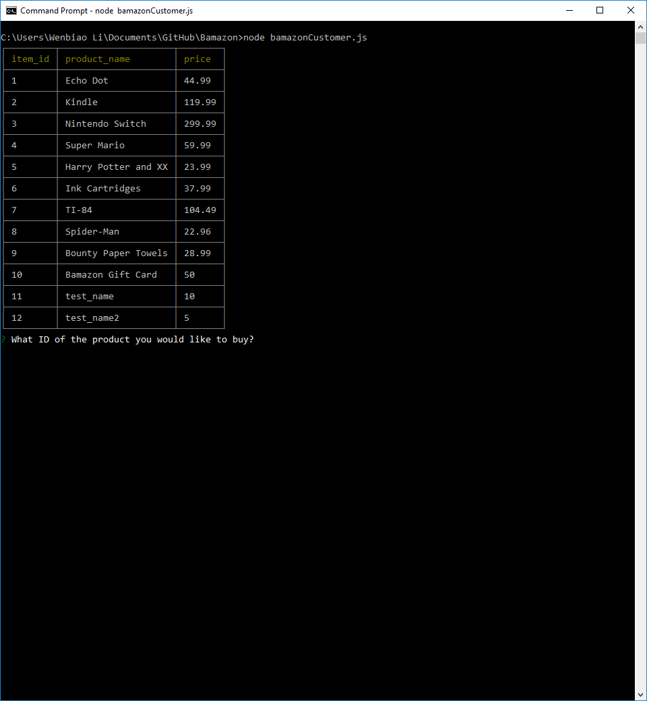
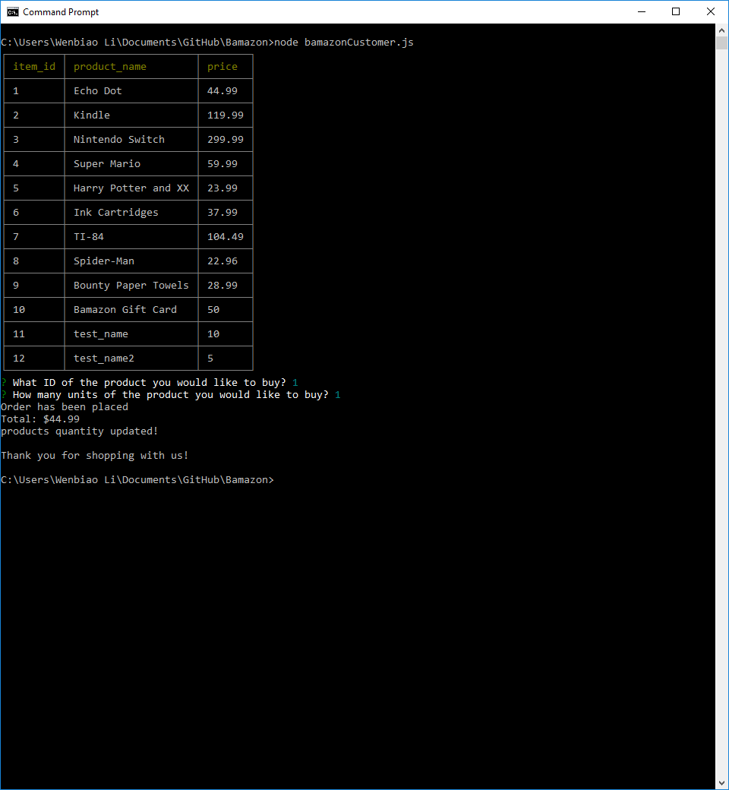
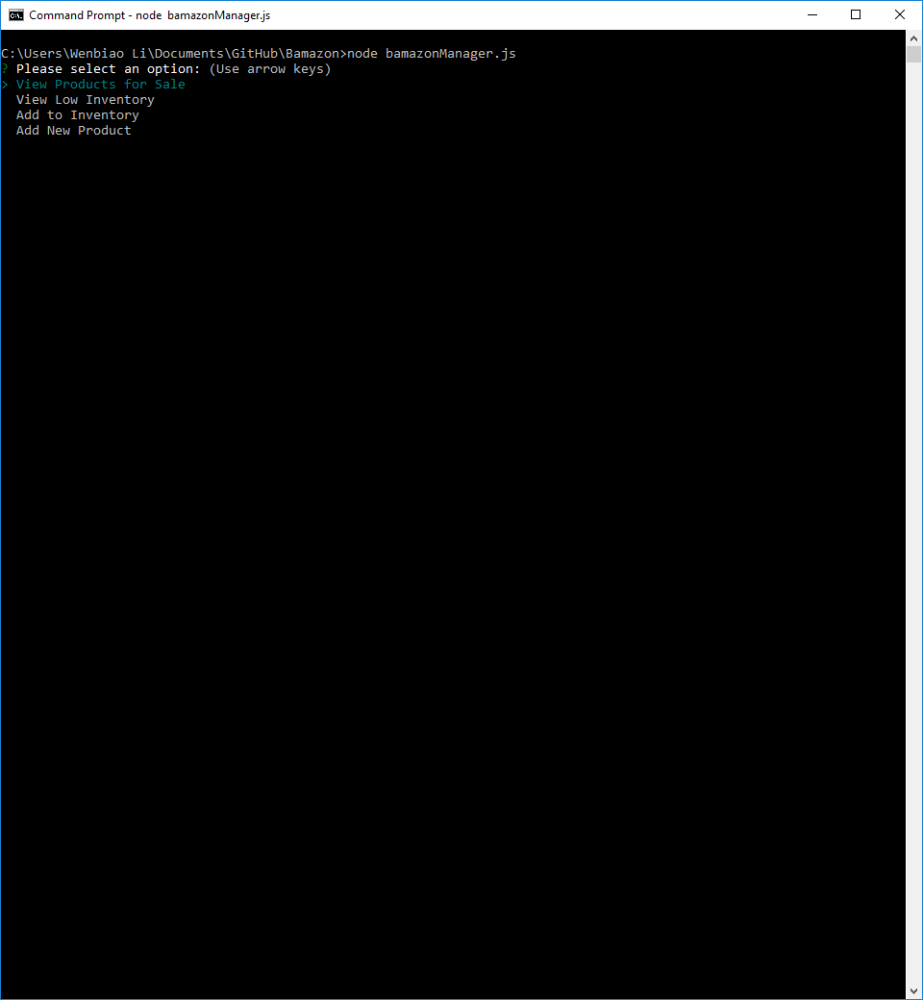
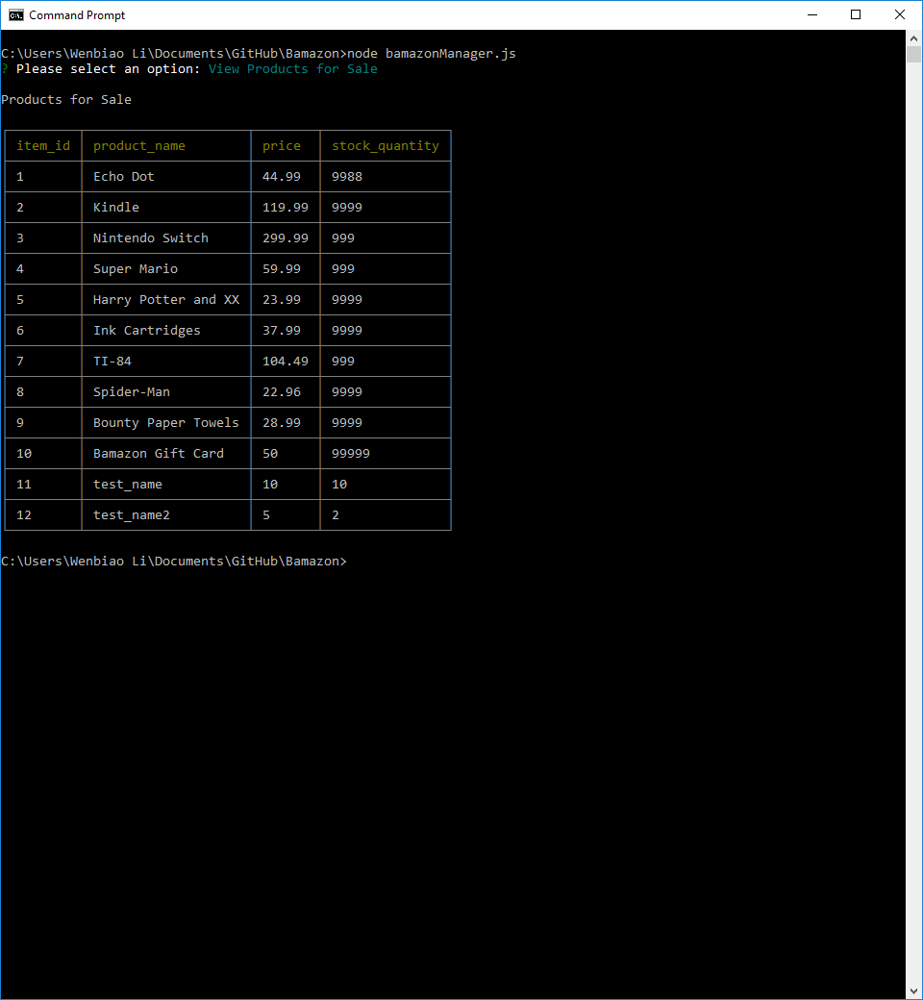
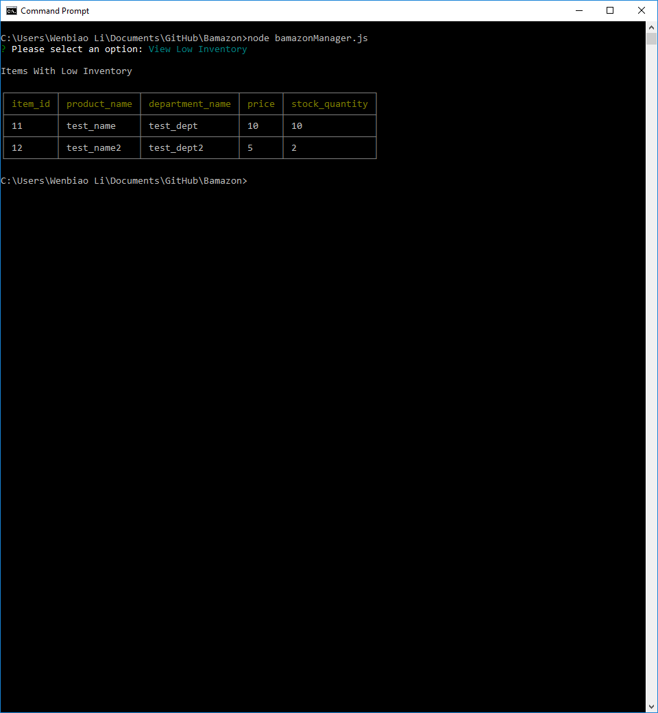
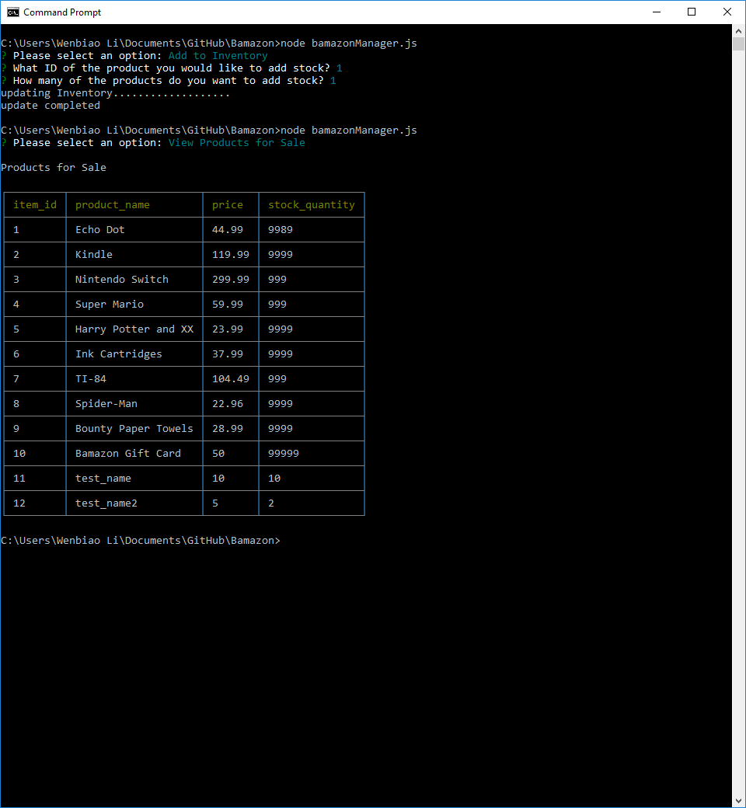
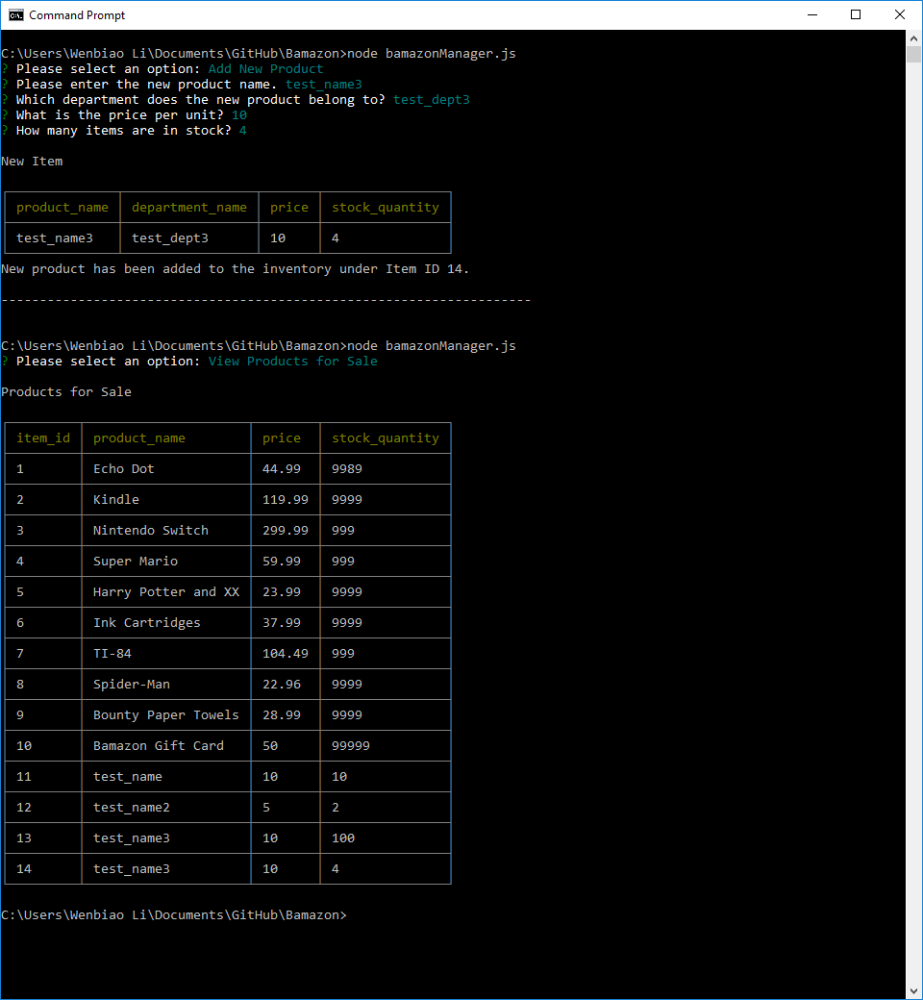

# Bamazon
A storefront build with the database created by MySQL, and command with Node.js.

## Customer View

* Display the product data from database 

* Customers are allowed to input the id and quantity of the product they want to purchase

## Manager View

* Display four choices of actions at the beginning

* Display all the current products in stock

* Display the products which has no more than 10 in quantity

* The process of adding inventory of chosen item by id

* The process of adding a new item to the database

